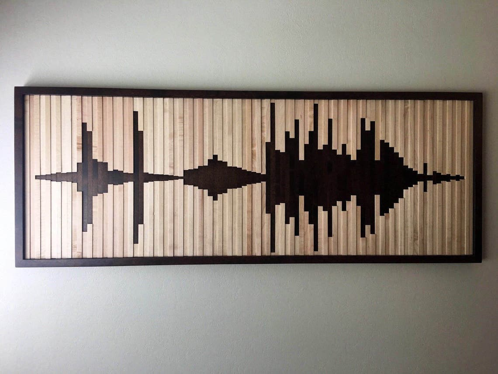
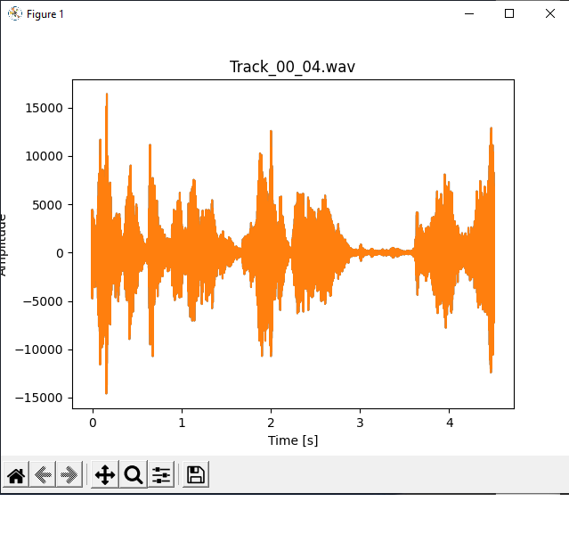
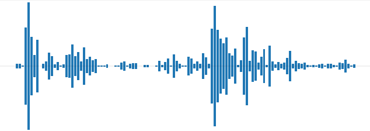

# Audio 1 #

Looking at making some art for our halls.

This is a dark brown frame, filled with lighter and darker strips
There are two alternating depths of strips.

## Data ##

This example wave form is symmetric.
It also never goes to zero, and starts and ends multiple bars from the end.
There are about 96 bars in the example

I want to pattern to be a meaningful sound wave.

This is the sound wave of my wife, son and daughter all laughing.
Track_00_04.wav processes by a python script

I've resampled the waveform to 1000th of the length, and averaged over the 1000 sample windows.
I've plotted it with pyplot, but also used paint to mirror the bars.

## Materials ##

I could use flooring are the raw material. It would  be lightweight.
I have the dark already. I'd just need the light